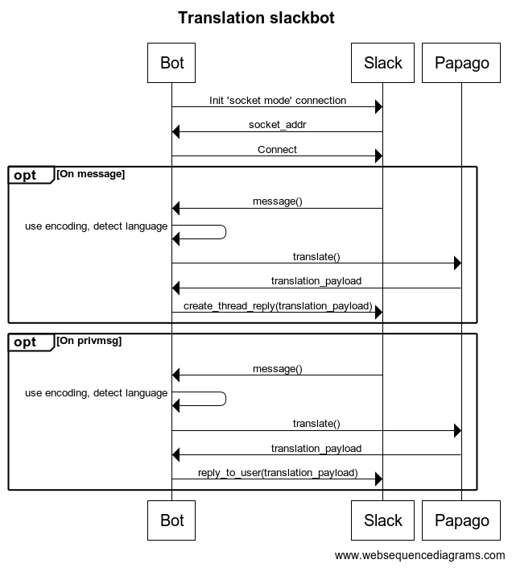

# Databank Korean to English (and back again!) bot

A small slack bot which translates Korean slack messages into English, and English messages into Korean, which it does via [papago](https://developers.naver.com/docs/papago/README.md)

It can be invited into slack channels, where it will:

1. Listen out for new messages
2. Translate messages from one language to the other (based on character encodings, and sentence structure)
3. Respond to messages again in a thread




This bot requires the following env vars:

| Env var                | Description                                                                                                 |
|------------------------|-------------------------------------------------------------------------------------------------------------|
| `$SLACK_BOT_TOKEN`     | The bot token used to authenticate against slack. See: https://api.slack.com/authentication/token-types#bot |
| `$SLACK_APP_TOKEN`     | The app token used to perform app level tasks. See: https://api.slack.com/authentication/token-types#app    |
| `$NAVER_CLIENT_ID`     | See: https://developers.naver.com/docs/papago/README.md                                                     |
| `$NAVER_CLIENT_SECRET` | See: https://developers.naver.com/docs/papago/README.md                                                     |

## Installation

Included in this project is a `manifest.yml` file which can be used to configure slack.

## Building

This bot can be built using pretty standard go tools:

```bash
$ go build
```

Or via docker:

```bash
$ docker build -t foo .
```

## Running

If you've built the app yourself, then happy day- there's your binary!

Otherwise I suggest via docker:

```bash
$ docker build -t foo .
$ docker run foo
```

(Setting the above environment variables accordingly)
